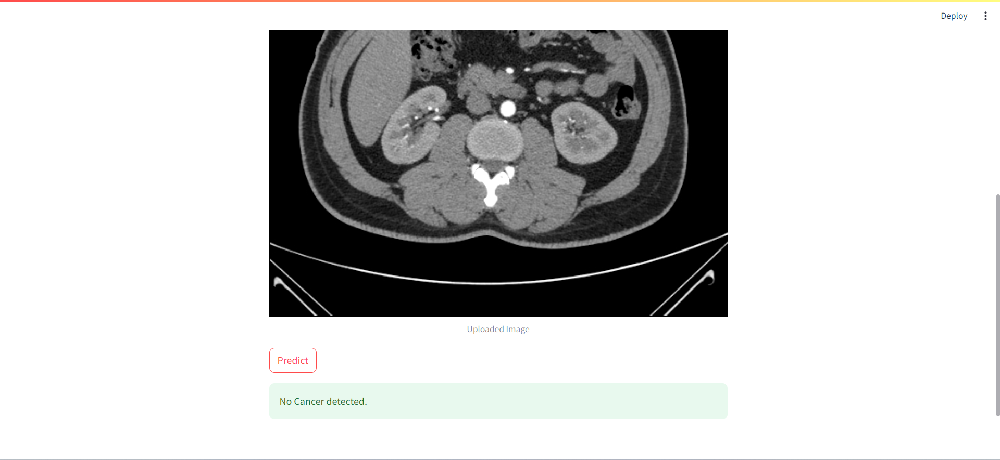
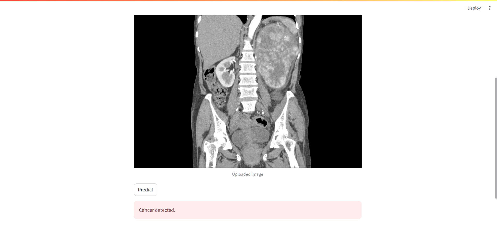

# Kidney_Diseease_Classification

This project establishes a pipeline that orchestrates the training of a comprehensive kidney cancer classification model using input medical image data, diligently tracks experiments by logging model artifacts, parameters, and performance metrics. It subsequently transforms the model into a user-friendly web application, encapsulates it within a Docker container, and deploys the application, housing the meticulously trained kidney cancer classification model, onto a cloud server. This entire process is seamlessly integrated with Continuous Integration/Continuous Deployment (CI/CD) practices, enabling automated tests and reliable releases for advanced healthcare decision support.
## Author

- [@HamzaJAKOUK](https://www.github.com/hamzajakouk)

## Languages and Tools

<div align="">
<a href="https://www.python.org" target="_blank" rel="noreferrer"></a>
<a href="https://www.mlflow.org/docs/latest/python_api/mlflow.html" target="_blank" rel="noreferrer"></a>
<a href="https://www.docker.com/" target="_blank" rel="noreferrer"></a>
<a href="https://www.tensorflow.org" target="_blank" rel="noreferrer"></a>
<a href="https://streamlit.io" target="_blank" rel="noreferrer"></a>
<a href="https://github.com/features/actions" target="_blank" rel="noreferrer"></a>
<a href="https://docs.pytest.org/en/7.1.x/" target="_blank" rel="noreferrer"></a>
<a href="https://azure.microsoft.com/" target="_blank" rel="noreferrer"></a>
<a href="https://th.bing.com/th/id/R.82986e112ecefabbcfbaf960e2c8fb36?rik=SfIPu6t13UB87Q&pid=ImgRaw&r=0" target="_blank" rel="noreferrer"></a>
</div>
<br>

## Kidney Cancer Detection - Demo

|  |
|:--:|
| <b>Figure 1a: App demo - Image of kidney input to app for predicting state from trained model artifact</b>|

|  |
|:--:|
| <b>Figure 1b: App demo - another example of affected Kidney</b>|

_**Disclaimer:**_ <br>
_1. This app is just a demo and not for realtime usage. The main objective is to get ML models into production in terms of deployment and CI/CD, from MLOps paradigm_. <br>
_2. Additionally, due to some technical issues in the Heroku backend, the app currently crashes, so the Heroku app link is not provided as of now. It will be updated once the issues are solved and when the app is up and running_.
## Workflows
1. Update config.yaml
2. Update secrets.yaml [Optional]
3. Update params.yaml
4. Update the entity
5. Update the configuration manager in src config
6. Update the components
7. Update the pipeline
8. Update the main.py
9. Update the dvc.yaml
10. app.py


# How to run?


### STEPS:

Clone the repository

```bash
https://github.com/hamzajakouk/Kidney_Diseease_Classification_MLFLOW_DVC.git
```

### STEP 01 : Createa conda environment after opening the repository

```bash
conda create -n "name of the environment" python=3.8 -y
```

``` 
conda activate (name of the environment) 
```

### STEP 02 : install requirements from the repository

```bash
pip install -r requirements.txt
```

## MLflow

- [Documentation](https://mlflow.org/docs/latest/index.html)

- [MLflow tutorial](https://youtu.be/qdcHHrsXA48?si=bD5vDS60akNphkem)

##### cmd
- mlflow ui

### dagshub
[dagshub](https://dagshub.com/)

MLFLOW_TRACKING_URI=https://dagshub.com/hamzajakouk/Kidney_Diseease_Classification_MLFLOW_DVC.mlflow 
MLFLOW_TRACKING_USERNAME=hamzajakouk 
MLFLOW_TRACKING_PASSWORD=29cfead8f9e5f527b1c0652a73c807159f5ea80b 
python script.py

Run this to export as env variables:

```bash

export MLFLOW_TRACKING_URI=https://dagshub.com/hamzajakouk/Kidney_Diseease_Classification_MLFLOW_DVC.mlflow

export MLFLOW_TRACKING_USERNAME=hamzajakouk 
export MLFLOW_TRACKING_PASSWORD=29cfead8f9e5f527b1c0652a73c807159f5ea80b 
