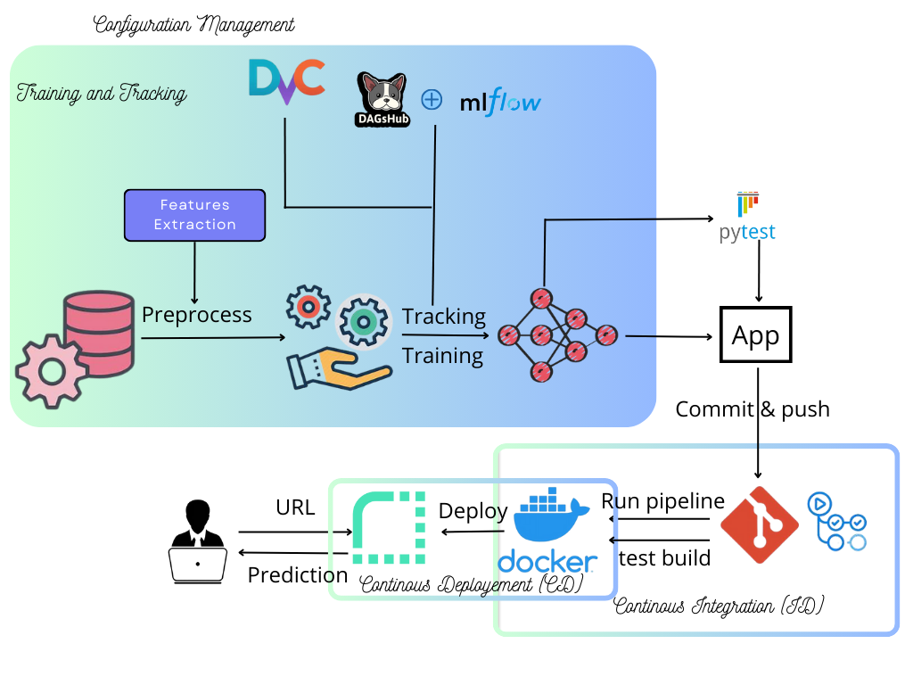
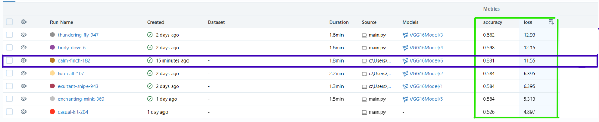

# Kidney_Diseease_Classification

This project establishes a pipeline that orchestrates the training of a comprehensive kidney cancer classification model using input medical image data, diligently tracks experiments by logging model artifacts, parameters, and performance metrics. It subsequently transforms the model into a user-friendly web application, encapsulates it within a Docker container, and deploys the application, housing the meticulously trained kidney cancer classification model, onto a cloud server. This entire process is seamlessly integrated with Continuous Integration/Continuous Deployment (CI/CD) practices, enabling automated tests and reliable releases for advanced healthcare decision support.
## Author

- [@HamzaJAKOUK](https://www.github.com/hamzajakouk)

## Languages and Tools

<div align="">
<a href="https://www.python.org" target="_blank" rel="noreferrer"></a>
<a href="https://www.mlflow.org/docs/latest/python_api/mlflow.html" target="_blank" rel="noreferrer"></a>
<a href="https://www.docker.com/" target="_blank" rel="noreferrer"></a>
<a href="https://www.tensorflow.org" target="_blank" rel="noreferrer"></a>
<a href="https://streamlit.io" target="_blank" rel="noreferrer"></a>
<a href="https://github.com/features/actions" target="_blank" rel="noreferrer"></a>
<a href="https://docs.pytest.org/en/7.1.x/" target="_blank" rel="noreferrer"></a>
<a href="https://azure.microsoft.com/" target="_blank" rel="noreferrer"></a>
<a href="https://th.bing.com/th/id/R.82986e112ecefabbcfbaf960e2c8fb36?rik=SfIPu6t13UB87Q&pid=ImgRaw&r=0" target="_blank" rel="noreferrer"></a>
</div>
<br>

## Kidney Cancer Detection - Demo

|  |
|:--:|
| <b>Figure 1a: App demo - Image of kidney input to app for predicting state from trained model artifact</b>|

|  |
|:--:|
| <b>Figure 1b: App demo - another example of affected Kidney</b>|

## Directory Structure
```
├───.github
│   └───workflows
├───artifacts
│   ├───data_ingestion
│   │   └───datasets
│   │       ├───Normal
│   │       └───Tumor
│   ├───prepare_base_model
│   └───training
├───config
├───images
├───Kidney_Diseease_Classification_MLFLOW_DVC.git
│   ├───hooks
│   ├───info
│   ├───objects
│   │   ├───info
│   │   └───pack
│   └───refs
│       ├───heads
│       └───tags
├───logs
├───mlruns
│   ├───.trash
│   └───0
│       ├───2ff8c581e6294bfb958a21a8e69825e1
│       │   ├───artifacts
│       │   │   └───model
│       │   │       └───data
│       │   │           └───model
│       │   │               ├───assets
│       │   │               └───variables
│       │   ├───metrics
│       │   ├───params
│       │   └───tags
│       
├───model
├───params
├───research
├───src
│   ├───cnnClassifier
│   │   ├───components
│   │   │   └───__pycache__
│   │   ├───config
│   │   │   └───__pycache__
│   │   ├───constants
│   │   │   └───__pycache__
│   │   ├───entity
│   │   │   └───__pycache__
│   │   ├───pipeline
│   │   │   ├───logs
│   │   │   └───__pycache__
│   │   ├───utils
│   │   │   └───__pycache__
│   │   └───__pycache__
│   └───cnnClassifier.egg-info
└───templates
```
## Motivation

`Deep learning/Machine learning` or `AI` (in short) is the current hot topic which has its application in most of the fields and it's demand is increasing day-by-day. But at this point, the sad truth is - `Only very less percentage of ML/DL models makes into production`. That's when `MLOps` comes into the picture. 

The major challenges with ML during development are:
  - Development, training and deployment environment can be different leading to dependency hassles.
  - Whenever input data changes, its becomes more tedious to reproduce the experiment.
  - Experiment tracking and analyzing can mostly be difficult and challenging.
  - Core ML code turn out to be spaghetti jungle which introduces lot of `boilerplate` codes.

MLOps is a budding field that productionalize ML models. `ML/DL` being a core research field, still misses out the `deployment` paradigm which includes design principles, patterns, testing, code styles etc. This restricts the domain to be used in the production environment efficiently. To nullify this, MLOps integrates DevOps principles into ML domain and serves as an intersection point of `Machine learning`, `Datascience` and `DevOps`.

## Description

The kidney cancer classification project integrates research and development phases to leverage machine learning for precise disease diagnosis. It includes data processing, deep neural network training, and rigorous model evaluation. In the deployment phase, it utilizes web app development, Docker containerization, and cloud PaaS for scalable model access. Modern CI/CD practices ensure automated pipelines for continuous integration and reliable releases, aiming to enhance early kidney cancer detection and medical decision support.

|  |
|:--:|
| <b>Figure 2: Project Workflow - Deployment with CI/CD</b>|

## Workflows
1. Update config.yaml
2. Update secrets.yaml [Optional]
3. Update params.yaml
4. Update the entity
5. Update the configuration manager in src config
6. Update the components
7. Update the pipeline
8. Update the main.py
9. Update the dvc.yaml
10. app.py

## VGG16: A Brief Overview

### Introduction:
- **VGG16** is a deep convolutional neural network.
- Known for simplicity and effectiveness in computer vision.

### Key Features:
- 16-layer architecture, including 13 convolutional layers and 3 fully connected layers.
- Uses small 3x3 convolutional kernels for feature extraction.
- Widely used in image classification and object detection.

### Advantages:
- Simplicity and uniform structure.
- Proven effectiveness in various computer vision tasks.

### Challenges:
- Large number of parameters can be computationally expensive.

### Conclusion:
- VGG16 remains a classic and valuable reference in deep learning.

 _**Note:** This project is not core research-centric. So the model with validation accuracy of 82% used, may not be the best optimized one achieving state-of-the-art performance as hyperparameter tuning is not performed. They are out of the scope of this project, as the main objective is to develop an end-to-end pipeline from data preparation till deployment via CI/CD pipelines `(MLOps paradigm)`._

### MLflow - Model tracking

[MLflow](https://mlflow.org/) is an open source platform for managing end-to-end machine learning lifecycle. It provides functionality to track, log, register and deploy models. But in this project, MLflow is only used for experiment tracking and logging model artifacts with metrics and parameters. The **directory tree** is:

```
b49972533469474f8cfd65b9ab0184c0
    ├───artifacts
    │   └───model
    │       └───data
    │           └───model
    │               ├───assets
    │               └───variables
    ├───metrics
    ├───params
    └───tags
```
[log_into_mlflow](./src/components/evaluation_model.py) provides the definition of `MLFlowTracker` user-defined dataclass which handles the entire MLflow tracking responsibility. It is implemented with the interface `ExperimentTracker(Protocol)` with the flexibility to be used for any logging. The tracking, logging of model artifacts, parameters etc. are done by `MLFlowTracker` class. for visualizition we use DagsHub as rmote ui fo our model tracking through which all model experiments (runs) can be viewed. The model selection process is done by:


|  |
|:--:|
| <b>Figure 3: Model selection via DagsHUb UI</b>|


# How to run?


### STEPS:

Clone the repository

```bash
https://github.com/hamzajakouk/Kidney_Diseease_Classification_MLFLOW_DVC.git
```

### STEP 01 : Createa conda environment after opening the repository

```bash
conda create -n "name of the environment" python=3.8 -y
```

``` 
conda activate (name of the environment) 
```

### STEP 02 : install requirements from the repository

```bash
pip install -r requirements.txt
```

## MLflow

- [Documentation](https://mlflow.org/docs/latest/index.html)

- [MLflow tutorial](https://youtu.be/qdcHHrsXA48?si=bD5vDS60akNphkem)

##### cmd
- mlflow ui

### dagshub
[dagshub](https://dagshub.com/)

MLFLOW_TRACKING_URI=https://dagshub.com/hamzajakouk/Kidney_Diseease_Classification_MLFLOW_DVC.mlflow 
MLFLOW_TRACKING_USERNAME=hamzajakouk 
MLFLOW_TRACKING_PASSWORD=29cfead8f9e5f527b1c0652a73c807159f5ea80b 
python script.py

Run this to export as env variables:

```bash

export MLFLOW_TRACKING_URI=https://dagshub.com/hamzajakouk/Kidney_Diseease_Classification_MLFLOW_DVC.mlflow

export MLFLOW_TRACKING_USERNAME=hamzajakouk 
export MLFLOW_TRACKING_PASSWORD=29cfead8f9e5f527b1c0652a73c807159f5ea80b 
